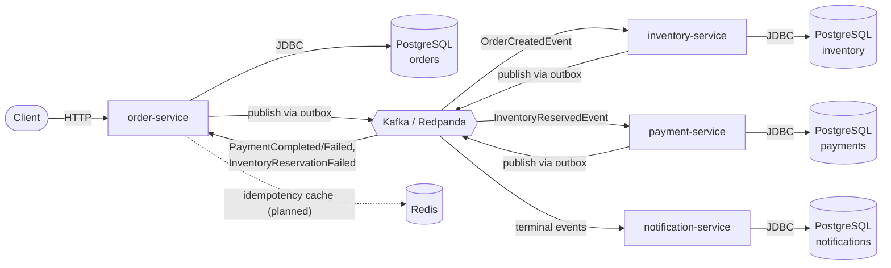
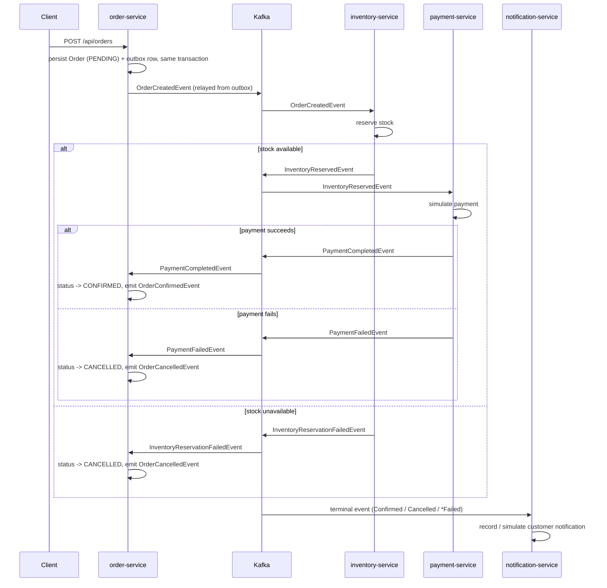

# Cloud-Native Order Management Platform

An event-driven order management system built as a modular Java monorepo, demonstrating
the patterns a distributed e-commerce backend actually needs in production: reliable
event publishing, idempotent APIs, saga-style orchestration across services, and
centralized observability — not just CRUD over a database.

> **Status: Milestone 1.** `order-service` is implemented end-to-end (API, persistence,
> idempotency, OpenAPI, tests, Docker). `inventory-service`, `payment-service`, and
> `notification-service`, along with the Kafka event flow that connects everything, are
> designed (see [Architecture](#architecture) and `docs/`) and scheduled for Milestones 2–3.
> See [Roadmap](#roadmap) for the exact delivery plan.

## Table of contents

- [Why this project exists](#why-this-project-exists)
- [Architecture](#architecture)
- [Business flow](#business-flow)
- [Technology stack](#technology-stack)
- [Production patterns](#production-patterns)
- [Project structure](#project-structure)
- [Running locally](#running-locally)
- [API examples](#api-examples)
- [Testing strategy](#testing-strategy)
- [Roadmap](#roadmap)
- [Future improvements](#future-improvements)
- [Screenshots / demo](#screenshots--demo)

## Why this project exists

Most portfolio backend projects stop at "CRUD API with a database." That demonstrates
you can use a framework — it doesn't demonstrate you can build the thing a backend team
actually gets paged about: a multi-service flow where a network blip, a duplicate retry,
or a concurrent update shouldn't corrupt state or lose an event.

This project picks one deliberately ordinary business process — placing an order — and
builds it the way a senior engineer would defend in a design review: an outbox so events
can't be lost between a database commit and a Kafka publish, idempotency keys so a
retried `POST` can't double-charge a customer, optimistic locking so two concurrent
updates don't silently clobber each other, and a saga (not a distributed transaction)
coordinating order, inventory, and payment. The goal is for the code itself to be the
artifact that answers "show me you've actually built distributed systems," for the
audience of recruiters, engineering managers, and interviewers who will read it.

## Architecture

Target end-state — a modular monorepo of independently deployable services
communicating asynchronously through Kafka, each owning its own data:



Why a monorepo instead of five repositories: at this scale, splitting repos buys you
nothing but multiplies the ceremony (five CI pipelines, five versioning schemes, cross-repo
PRs to change one event contract) without the team size that makes independent release
cadence worth it. `shared-kernel` is deliberately small — error model, exceptions,
correlation-id propagation — so it can't become a dumping ground that re-couples the
services it's meant to decouple. Each service still owns its own database and is built,
tested, and (eventually) deployed independently; the monorepo is a development-time
convenience, not a runtime coupling.

See [`docs/architecture.md`](docs/architecture.md) for the per-service breakdown and the
reasoning behind each technology choice.

## Business flow



This is a choreography-based saga: there's no central orchestrator deciding what
happens next, just each service reacting to events and publishing its own. The trade-off
and why it was chosen over orchestration is covered in
[`docs/saga-flow.md`](docs/saga-flow.md).

## Technology stack

| Concern               | Choice                                  |
|------------------------|------------------------------------------|
| Language / runtime     | Java 21                                  |
| Framework               | Spring Boot 3                            |
| Build                   | Maven (multi-module reactor)             |
| Persistence             | PostgreSQL, Spring Data JPA, Flyway      |
| Messaging               | Kafka-API-compatible (Redpanda locally)  |
| Cache                   | Redis                                    |
| API docs                | springdoc-openapi / Swagger UI           |
| Containerization        | Docker, Docker Compose                  |
| Testing                 | JUnit 5, Mockito, AssertJ, Testcontainers|
| CI                      | GitHub Actions                           |

## Production patterns

Each of these is a deliberate response to a specific failure mode, not a checkbox.
Full write-ups are in `docs/`; short version:

- **Outbox pattern** — an event is written to an `outbox` table in the *same* database
  transaction as the business state change, then relayed to Kafka asynchronously. This is
  what makes "save the order and publish `OrderCreated`" atomic without a distributed
  transaction. See [`docs/outbox-pattern.md`](docs/outbox-pattern.md). *(Milestone 2.)*
- **Idempotency keys** — `POST /api/orders` accepts an `Idempotency-Key` header. Replaying
  the same key with the same payload returns the original order; reusing it with a
  different payload returns `409 Conflict`. Implemented now — see
  [`OrderServiceImpl`](order-service/src/main/java/com/nazila/ordermgmt/order/service/OrderServiceImpl.java).
- **Optimistic locking** — `Order.version` is a JPA `@Version` column. A concurrent update
  that loses the race gets `409 Conflict`, not a silently overwritten row.
- **Retry handling & Dead Letter Topic** — Kafka consumers will retry transient failures
  with backoff and route exhausted messages to a `*.DLT` topic rather than blocking the
  partition or dropping the message. *(Milestone 2 — see `docs/saga-flow.md`.)*
- **Clear transaction boundaries** — each `@Transactional` method maps to exactly one
  aggregate mutation; nothing reaches across service/database boundaries inside a
  transaction, by construction.
- **Validation** — Bean Validation (`jakarta.validation`) on every request DTO; failures
  surface as `400` with a field-level breakdown, not a stack trace.
- **Centralized error responses** — every service shares one `ApiError` contract and one
  `@RestControllerAdvice` (`shared-kernel`), so a client learns the error shape once.
- **Correlation ID** — a filter in `shared-kernel` stamps every request (and will stamp
  every outgoing event) with an `X-Correlation-Id`, propagated through MDC so every log
  line for a request — across every service that touches it — is traceable to one id.
- **Event versioning** — event envelopes carry a `version` field from day one, so a
  consumer can branch on schema rather than break on it. *(Milestone 2.)*
- **OpenAPI documentation** — every endpoint is annotated; Swagger UI is live at
  `/swagger-ui.html` on every service.
- **Integration tests with Testcontainers** — tests run against a real PostgreSQL (and,
  from Milestone 2, a real Kafka broker) in a disposable container, not an in-memory fake
  that papers over driver-specific behavior.

## Project structure

```
order-management-platform/
├── shared-kernel/          # Cross-service error model, exceptions, correlation-id filter
├── order-service/          # Implemented: owns the order aggregate
├── inventory-service/      # Planned (Milestone 2): stock reservation
├── payment-service/        # Planned (Milestone 3): payment simulation
├── notification-service/   # Planned (Milestone 3): customer notifications
├── docs/                   # Architecture & pattern deep-dives
├── docker-compose.yml      # PostgreSQL, Redis, Redpanda, order-service
└── .github/workflows/ci.yml
```

## Running locally

Prerequisites: Docker (with Compose). For local development without Docker, JDK 21 and
Maven.

```bash
# Build the image and start Postgres, Redis, Redpanda, and order-service
docker compose up --build

# order-service:   http://localhost:8081
# Swagger UI:      http://localhost:8081/swagger-ui.html
# Health:          http://localhost:8081/actuator/health
```

Running just `order-service` against a local Maven/JDK toolchain (Postgres still needs to
be running, e.g. via `docker compose up postgres`):

```bash
mvn -pl order-service -am spring-boot:run
```

Running the test suite:

```bash
mvn test     # unit tests only
mvn verify   # unit + Testcontainers integration tests (needs Docker)
```

## API examples

Full request/response pairs for every endpoint, including the idempotency-conflict and
validation-error cases, are in [`docs/api-examples.md`](docs/api-examples.md). Quick
start:

```bash
# Create an order
curl -X POST http://localhost:8081/api/orders \
  -H "Content-Type: application/json" \
  -H "Idempotency-Key: 5b1f7c9e-1c2d-4e3f-9a4b-1234567890ab" \
  -d '{
        "customerId": "11111111-1111-1111-1111-111111111111",
        "currency": "USD",
        "items": [
          { "productId": "22222222-2222-2222-2222-222222222222", "quantity": 2, "unitPrice": 19.99 }
        ]
      }'

# Fetch it back
curl http://localhost:8081/api/orders/{id}

# List orders for a customer
curl "http://localhost:8081/api/orders?customerId=11111111-1111-1111-1111-111111111111&page=0&size=20"

# Cancel it
curl -X POST http://localhost:8081/api/orders/{id}/cancel
```

## Testing strategy

Unit tests cover domain invariants (`Order`) and service-layer branching (idempotency
replay/conflict, not-found, cancellation rules) with mocked repositories — fast, no I/O.
Integration tests spin up real PostgreSQL via Testcontainers and drive the actual HTTP API
end-to-end (create → get, cancel → re-cancel conflict, idempotency replay → conflict).
Full rationale, including why Testcontainers over H2, is in
[`docs/testing-strategy.md`](docs/testing-strategy.md).

## Roadmap

- [x] **Milestone 1** — `order-service`: PostgreSQL persistence, idempotent `POST
      /api/orders`, optimistic locking, centralized errors, correlation IDs, OpenAPI,
      Testcontainers integration tests, Docker Compose, CI.
- [ ] **Milestone 2** — Outbox-backed event publishing from `order-service`;
      `inventory-service` consuming `OrderCreatedEvent` and reserving stock; retry/DLT
      handling.
- [ ] **Milestone 3** — `payment-service` (simulated payment, saga completion) and
      `notification-service` (terminal-event consumer); full end-to-end saga integration
      test across all four services.

## Future improvements

- Distributed tracing (OpenTelemetry + Jaeger/Tempo) instead of correlation-ID-only log
  tracing.
- A schema registry (Avro/Protobuf) for event contracts instead of versioned JSON.
- Kubernetes manifests / Helm chart for a deployment target beyond Compose.
- An API gateway in front of the four services instead of direct client-to-service calls.
- Rate limiting and request quotas at the gateway layer.
- Chaos-testing the saga (kill a consumer mid-reservation, verify the DLT and compensating
  cancellation both fire correctly).

## Screenshots / demo

_Swagger UI and a recorded end-to-end order flow will be added here once Milestone 2 ships
the full saga — a single `order-service` CRUD screenshot wouldn't represent the project
well on its own._
