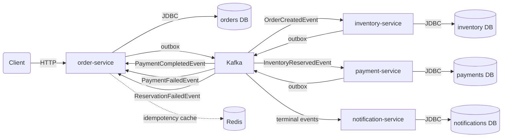
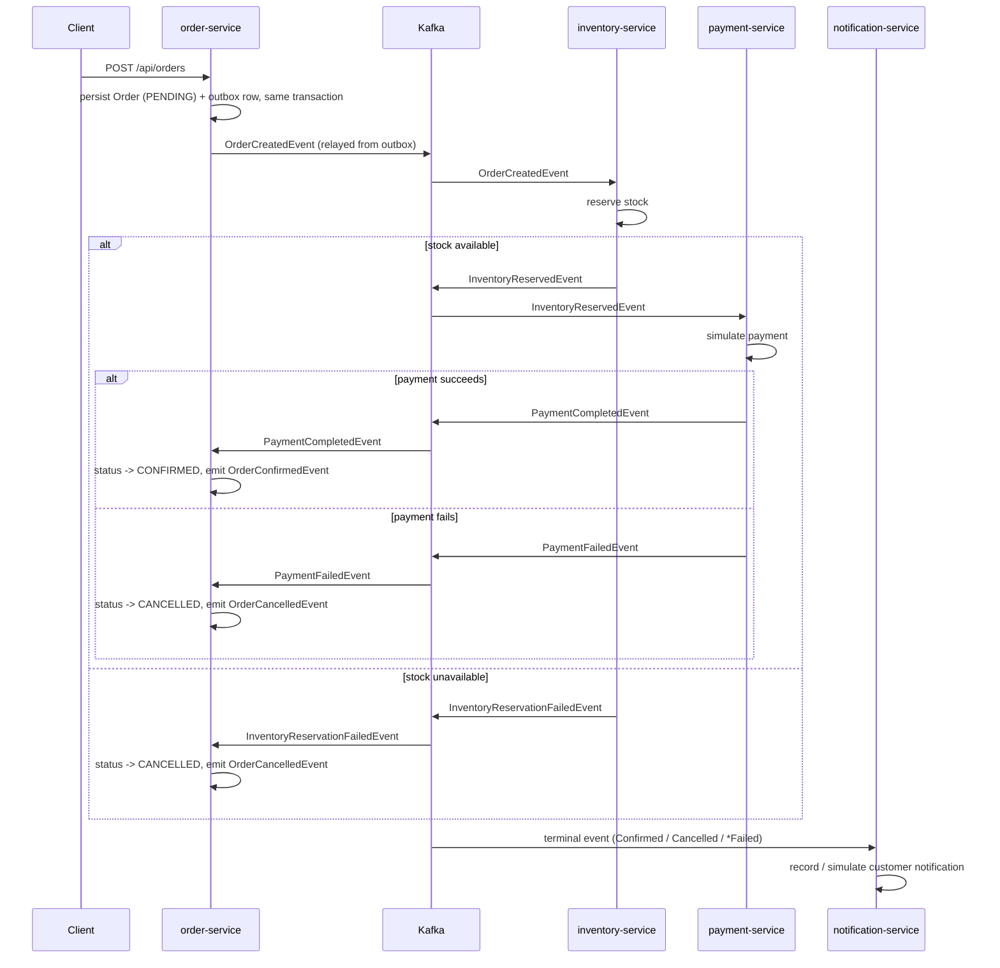

# Cloud-Native Order Management Platform

An event-driven order management system built as a modular Java monorepo, demonstrating
the patterns a distributed e-commerce backend actually needs in production: reliable
event publishing, idempotent APIs, saga-style orchestration across services, and
centralized observability — not just CRUD over a database.

> **Status: Milestone 2.** `order-service` and `inventory-service` are implemented
> end-to-end, connected by a real Kafka event flow: `order-service` writes an
> `OrderCreatedEvent` to its outbox on every order, a relay publishes it, and
> `inventory-service` consumes it, reserves stock, and publishes the result back through
> its own outbox. `payment-service` and `notification-service` are designed (see
> [Architecture](#architecture) and `docs/`) and scheduled for Milestone 3. See
> [Roadmap](#roadmap) for the exact delivery plan.

## Table of contents

- [Why this project exists](#why-this-project-exists)
- [Architecture](#architecture)
- [Business flow](#business-flow)
- [Technology stack](#technology-stack)
- [Production patterns](#production-patterns)
- [Project structure](#project-structure)
- [Running locally](#running-locally)
- [API examples](#api-examples)
- [Testing strategy](#testing-strategy)
- [Roadmap](#roadmap)
- [Future improvements](#future-improvements)
- [Screenshots / demo](#screenshots--demo)

## Why this project exists

Most portfolio backend projects stop at "CRUD API with a database." That demonstrates
you can use a framework — it doesn't demonstrate you can build the thing a backend team
actually gets paged about: a multi-service flow where a network blip, a duplicate retry,
or a concurrent update shouldn't corrupt state or lose an event.

This project picks one deliberately ordinary business process — placing an order — and
builds it the way a senior engineer would defend in a design review: an outbox so events
can't be lost between a database commit and a Kafka publish, idempotency keys so a
retried `POST` can't double-charge a customer, optimistic locking so two concurrent
updates don't silently clobber each other, and a saga (not a distributed transaction)
coordinating order, inventory, and payment. The goal is for the code itself to be the
artifact that answers "show me you've actually built distributed systems," for the
audience of recruiters, engineering managers, and interviewers who will read it.

## Architecture

Target end-state — a modular monorepo of independently deployable services
communicating asynchronously through Kafka, each owning its own data:



Why a monorepo instead of five repositories: at this scale, splitting repos buys you
nothing but multiplies the ceremony (five CI pipelines, five versioning schemes, cross-repo
PRs to change one event contract) without the team size that makes independent release
cadence worth it. `shared-kernel` is deliberately small — error model, exceptions,
correlation-id propagation — so it can't become a dumping ground that re-couples the
services it's meant to decouple. Each service still owns its own database and is built,
tested, and (eventually) deployed independently; the monorepo is a development-time
convenience, not a runtime coupling.

See [`docs/architecture.md`](docs/architecture.md) for the per-service breakdown and the
reasoning behind each technology choice.

## Business flow



This is a choreography-based saga: there's no central orchestrator deciding what
happens next, just each service reacting to events and publishing its own. The trade-off
and why it was chosen over orchestration is covered in
[`docs/saga-flow.md`](docs/saga-flow.md).

## Technology stack

| Concern               | Choice                                  |
|------------------------|------------------------------------------|
| Language / runtime     | Java 21                                  |
| Framework               | Spring Boot 3                            |
| Build                   | Maven (multi-module reactor)             |
| Persistence             | PostgreSQL, Spring Data JPA, Flyway      |
| Messaging               | Kafka-API-compatible (Redpanda locally)  |
| Cache                   | Redis                                    |
| API docs                | springdoc-openapi / Swagger UI           |
| Containerization        | Docker, Docker Compose                  |
| Testing                 | JUnit 5, Mockito, AssertJ, Testcontainers|
| CI                      | GitHub Actions                           |

## Production patterns

Each of these is a deliberate response to a specific failure mode, not a checkbox.
Full write-ups are in `docs/`; short version:

- **Outbox pattern** — an event is written to an `outbox_events` table in the *same*
  database transaction as the business state change, then relayed to Kafka by a
  `@Scheduled` poller. This is what makes "save the order and publish `OrderCreated`"
  atomic without a distributed transaction. Implemented in both `order-service`
  (`OrderOutboxRelay`) and `inventory-service` (`InventoryOutboxRelay`); the polling logic
  itself lives once in `shared-kernel`'s `OutboxRelay`. See
  [`docs/outbox-pattern.md`](docs/outbox-pattern.md).
- **Idempotency keys** — `POST /api/orders` accepts an `Idempotency-Key` header. Replaying
  the same key with the same payload returns the original order; reusing it with a
  different payload returns `409 Conflict`. See
  [`OrderServiceImpl`](order-service/src/main/java/com/nazila/ordermgmt/order/service/OrderServiceImpl.java).
- **Optimistic locking** — `Order.version` is a JPA `@Version` column. A concurrent update
  that loses the race gets `409 Conflict`, not a silently overwritten row.
- **Idempotent consumers** — Kafka delivery is at least once, so `inventory-service`
  records a `StockReservation` keyed by `orderId` before reserving stock, and a redelivered
  `OrderCreatedEvent` is recognized and skipped rather than double-reserving.
- **Retry handling & Dead Letter Topic** — every `@KafkaListener` in every service retries
  a failing message with exponential backoff (`shared-kernel`'s
  `KafkaErrorHandlingAutoConfiguration`) and then routes it to `<topic>.DLT` instead of
  blocking the partition or dropping it. See `docs/saga-flow.md`.
- **Clear transaction boundaries** — each `@Transactional` method maps to exactly one
  aggregate mutation; nothing reaches across service/database boundaries inside a
  transaction, by construction.
- **Validation** — Bean Validation (`jakarta.validation`) on every request DTO; failures
  surface as `400` with a field-level breakdown, not a stack trace.
- **Centralized error responses** — every service shares one `ApiError` contract and one
  `@RestControllerAdvice` (`shared-kernel`), so a client learns the error shape once.
- **Correlation ID** — a filter in `shared-kernel` stamps every request with an
  `X-Correlation-Id`; outgoing event envelopes carry it too, and Kafka listeners restore it
  into MDC for the duration of message processing, so one id traces a request across HTTP,
  the outbox, and every consumer that reacts to it.
- **Event versioning** — every `EventEnvelope` carries an `eventVersion` field from day
  one, so a consumer can branch on schema rather than break on it.
- **OpenAPI documentation** — every endpoint is annotated; Swagger UI is live at
  `/swagger-ui.html` on every service.
- **Integration tests with Testcontainers and embedded Kafka** — tests run against a real
  PostgreSQL in a disposable container (not an in-memory fake that papers over
  driver-specific behavior) and a real, in-process Kafka broker (`spring-kafka-test`'s
  `@EmbeddedKafka`), so the outbox-relay-to-consumer round trip is exercised end to end
  without requiring a Kafka container.

## Project structure

```
order-management-platform/
├── event-contracts/        # Plain-Java Kafka event envelope + payload contracts
├── shared-kernel/          # Cross-service error model, exceptions, correlation-id filter,
│                            # outbox relay, Kafka retry/DLT config
├── order-service/          # Implemented: owns the order aggregate
├── inventory-service/      # Implemented: owns stock reservation
├── payment-service/        # Planned (Milestone 3): payment simulation
├── notification-service/   # Planned (Milestone 3): customer notifications
├── docs/                   # Architecture & pattern deep-dives
├── docker-compose.yml      # 2x PostgreSQL, Redis, Redpanda, order-service, inventory-service
└── .github/workflows/ci.yml
```

## Running locally

Prerequisites: Docker (with Compose). For local development without Docker, JDK 21 and
Maven.

```bash
# Build the images and start both Postgres instances, Redis, Redpanda,
# order-service, and inventory-service
docker compose up --build

# order-service:       http://localhost:8081  (Swagger UI: /swagger-ui.html)
# inventory-service:   http://localhost:8082  (Swagger UI: /swagger-ui.html)
```

Running a single service against a local Maven/JDK toolchain (its own Postgres and Redpanda
still need to be running, e.g. via `docker compose up postgres redpanda` or `docker compose
up inventory-postgres redpanda`):

```bash
mvn -pl order-service -am spring-boot:run
mvn -pl inventory-service -am spring-boot:run
```

Running the test suite:

```bash
mvn test     # unit tests only
mvn verify   # unit + Testcontainers integration tests (needs Docker)
```

## API examples

Full request/response pairs for every endpoint, including the idempotency-conflict and
validation-error cases, are in [`docs/api-examples.md`](docs/api-examples.md). Quick
start:

```bash
# Create an order
curl -X POST http://localhost:8081/api/orders \
  -H "Content-Type: application/json" \
  -H "Idempotency-Key: 5b1f7c9e-1c2d-4e3f-9a4b-1234567890ab" \
  -d '{
        "customerId": "11111111-1111-1111-1111-111111111111",
        "currency": "USD",
        "items": [
          { "productId": "22222222-2222-2222-2222-222222222222", "quantity": 2, "unitPrice": 19.99 }
        ]
      }'

# Fetch it back
curl http://localhost:8081/api/orders/{id}

# List orders for a customer
curl "http://localhost:8081/api/orders?customerId=11111111-1111-1111-1111-111111111111&page=0&size=20"

# Cancel it
curl -X POST http://localhost:8081/api/orders/{id}/cancel
```

## Testing strategy

Unit tests cover domain invariants (`Order`, `Inventory`) and service-layer branching
(idempotency replay/conflict, not-found, cancellation rules, stock reservation
success/failure/redelivery) with mocked repositories — fast, no I/O. Integration tests spin
up real PostgreSQL via Testcontainers and an embedded Kafka broker (`spring-kafka-test`),
driving the actual HTTP API and Kafka listeners end-to-end: `order-service`'s suite covers
create → get, cancel → re-cancel conflict, idempotency replay → conflict, and that creating
an order is actually published to `order.events` via the outbox relay;
`inventory-service`'s suite publishes a real `OrderCreatedEvent` and asserts stock is
decremented and `InventoryReservedEvent`/`InventoryReservationFailedEvent` comes out the
other side. Full rationale, including why Testcontainers over H2, is in
[`docs/testing-strategy.md`](docs/testing-strategy.md).

## Roadmap

- [x] **Milestone 1** — `order-service`: PostgreSQL persistence, idempotent `POST
      /api/orders`, optimistic locking, centralized errors, correlation IDs, OpenAPI,
      Testcontainers integration tests, Docker Compose, CI.
- [x] **Milestone 2** — Outbox-backed event publishing from `order-service`;
      `inventory-service` consuming `OrderCreatedEvent` and reserving stock; retry/DLT
      handling for every Kafka consumer.
- [ ] **Milestone 3** — `payment-service` (simulated payment, saga completion) and
      `notification-service` (terminal-event consumer); full end-to-end saga integration
      test across all four services.

## Future improvements

- Distributed tracing (OpenTelemetry + Jaeger/Tempo) instead of correlation-ID-only log
  tracing.
- A schema registry (Avro/Protobuf) for event contracts instead of versioned JSON.
- Kubernetes manifests / Helm chart for a deployment target beyond Compose.
- An API gateway in front of the four services instead of direct client-to-service calls.
- Rate limiting and request quotas at the gateway layer.
- Chaos-testing the saga (kill a consumer mid-reservation, verify the DLT and compensating
  cancellation both fire correctly).

## Screenshots / demo

_Swagger UI and a recorded end-to-end order flow will be added here once Milestone 2 ships
the full saga — a single `order-service` CRUD screenshot wouldn't represent the project
well on its own._
