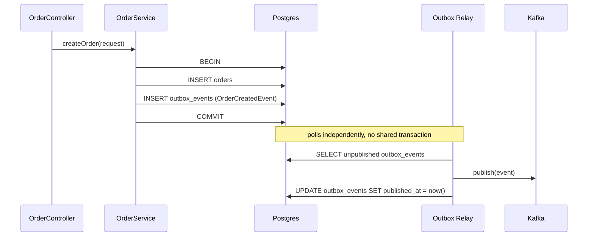

# Outbox pattern

**Status:** implemented in Milestone 2, in both `order-service` and `inventory-service`.
The relay's poll/publish loop is implemented once, in `shared-kernel`'s `OutboxRelay`; each
service supplies its own `outbox_events` table (via its own Flyway migration) and a
one-line topic mapping (`OrderOutboxRelay`, `InventoryOutboxRelay`).

## The problem it solves

`order-service` needs to do two things when an order is created: commit the `Order` row,
and publish an `OrderCreatedEvent` so `inventory-service` can react. Those two operations
talk to two different systems (Postgres and Kafka) that can't share a transaction. Without
care, one of two failure modes happens:

- **Commit first, then publish:** if the process crashes between the commit and the
  publish, the order exists but the event never goes out. `inventory-service` never
  reserves stock; the order sits in `PENDING` forever.
- **Publish first, then commit:** if the commit then fails (or never happens), consumers
  react to an order that doesn't exist in the system of record.

A two-phase commit across Postgres and Kafka would technically solve this, but Kafka
doesn't support XA transactions, and 2PC is operationally expensive even where it's
available. The outbox pattern gets the same atomicity guarantee using only the
primitives Postgres already gives you.

## How it works

1. In the **same transaction** that inserts/updates the `Order` row, insert a row into an
   `outbox_events` table: `(id, aggregate_type, aggregate_id, event_type, payload, version,
   correlation_id, created_at, published_at)`. Either both writes commit, or neither does —
   this is a single transaction against a single database.
2. A separate relay process (a `@Scheduled` poller in Milestone 2; a Debezium CDC connector
   would be the production-grade evolution of this) reads unpublished rows from
   `outbox_events`, publishes them to Kafka, and marks them `published_at`. If the publish
   fails, the row is simply retried on the next poll — it's still sitting there unpublished.
3. The relay publishes with the event's `aggregate_id` as the Kafka partition key, so all
   events for a given order are strictly ordered within a partition.

## What this buys, and what it costs

**Buys:** the event is published if and only if the business state change committed —
"at least once" delivery with no lost events, without a distributed transaction.

**Costs:** consumers must be idempotent, because "at least once" means a crash between
the Kafka publish and the `published_at` update causes a redelivery on the next poll.
Every event consumer in this platform (`inventory-service`'s reservation, `payment-
service`'s charge) is designed to be safe to process twice — typically by upserting on
the event's id rather than blindly applying it. There's also a small publish latency
(bounded by the poll interval) instead of synchronous publish-on-commit; for an order
flow where the next step is "wait for a saga step anyway," that latency is not on the
critical path.

## Dead Letter Topic

If a consumer fails to process an event after a bounded number of retries with backoff
(transient errors: a momentary DB outage; not "this event is malformed," which retrying
won't fix), it's routed to a `<topic>.DLT` topic rather than blocking the partition for
every order behind it or silently dropping the event. Operators can inspect, fix, and
replay from the DLT. Implemented once, for every consumer in every service, by
`shared-kernel`'s `KafkaErrorHandlingAutoConfiguration` (three retries with exponential
backoff, then `DeadLetterPublishingRecoverer`) — no service has to wire this up itself. See
[`saga-flow.md`](saga-flow.md) for where this sits in the overall flow.
