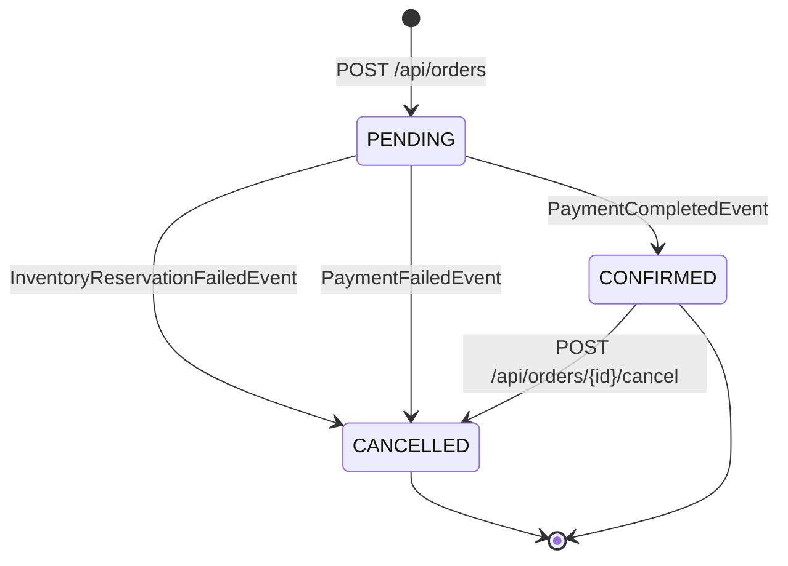

# Saga flow

**Status:** the order ↔ inventory leg is implemented (Milestone 2); the inventory ↔
payment ↔ notification legs ship in Milestone 3. This document is the design the
remaining legs are being built against.

## Choreography, not orchestration

There are two standard ways to coordinate a multi-step business transaction across
services: **orchestration** (a central coordinator calls each step and tracks state) and
**choreography** (each service reacts to events and emits its own, with no central
coordinator). This project uses choreography:

- `order-service` publishes `OrderCreatedEvent` and reacts to terminal events; it does
  not call `inventory-service` or `payment-service` directly, and it does not know they
  exist.
- `inventory-service` reacts to `OrderCreatedEvent`, publishes `InventoryReservedEvent` or
  `InventoryReservationFailedEvent`, and otherwise knows nothing about payments.
- `payment-service` reacts to `InventoryReservedEvent`, publishes `PaymentCompletedEvent`
  or `PaymentFailedEvent`, and knows nothing about inventory.

**Why choreography here:** with three downstream steps and no need for mid-saga business
logic (no "if the order is over $500, require manual approval before reserving stock"),
an orchestrator would add a service whose only job is forwarding events, with no
corresponding reduction in coupling. Choreography keeps each service's contract to
"the events I consume and the events I produce," independently testable and
independently deployable.

**Why it's the right trade-off to name explicitly:** choreography's real cost is that the
overall flow isn't visible in any single place — you have to read four services to
understand the saga. That's an honest trade-off, not a free lunch: it's right for three
steps with simple branching, and it's the first thing to revisit if a fourth or fifth
step with real cross-step business logic gets added later. An orchestrator (or a
process-manager pattern with explicit saga state) would be the correct call at that
point, not a sign this design was wrong.

## The full flow with failure paths

Compensation in this saga is simple by construction: if inventory reservation fails, there
is nothing to compensate (nothing was reserved). If payment fails *after* inventory was
reserved, `inventory-service` consumes `PaymentFailedEvent` and releases the reservation
it made — that release is the compensating action, and it's just another event-reaction,
not a special "rollback" code path.

## Idempotent consumers

Because delivery is "at least once" (see [`outbox-pattern.md`](outbox-pattern.md)), every
consumer must produce the same result whether it processes a given event once or three
times. In practice that means each consumer's handler is structured as an upsert keyed on
the event id (or the order id, for state transitions like "set status to CONFIRMED" that
are naturally idempotent already) rather than an unconditional insert or increment.

## Retry and Dead Letter Topic

Each consumer retries a failed event a bounded number of times with exponential backoff,
on the assumption that most failures (a momentary DB connection blip) are transient. An
event that's still failing after retries are exhausted is routed to a `<topic>.DLT` topic
instead of being dropped or blocking every event behind it on the same partition. This
policy is implemented once, in `shared-kernel`'s `KafkaErrorHandlingAutoConfiguration`, and
applies to every `@KafkaListener` in every service automatically. DLT entries are currently
inspected and replayed manually; a small admin endpoint that re-publishes a DLT entry back
onto its original topic remains a candidate for a later milestone.

## Event versioning

Every event envelope carries a `version` integer alongside its payload from the first
release, even though every event is `v1` today. The cost of adding it now is one field;
the cost of retrofitting it after a consumer is depending on payload shape in production
is a coordinated multi-service migration. A consumer that receives a version it doesn't
recognize logs and routes to the DLT rather than guessing at the schema.
